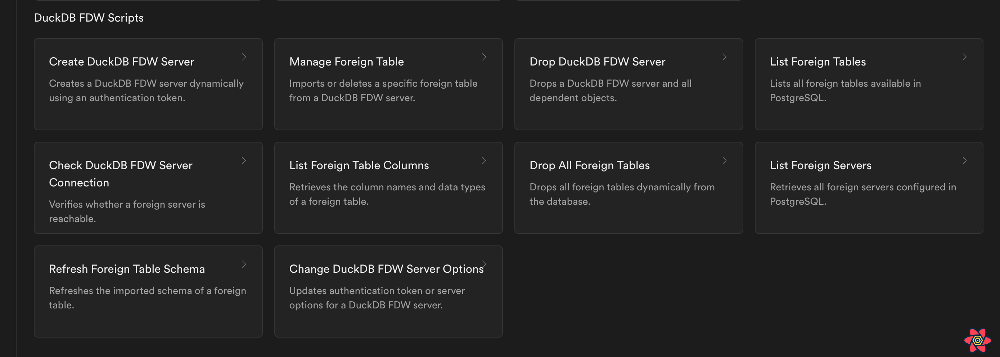

import { Callout } from 'nextra/components'

# DuckDB FDW Guide

## Overview

This guide provides a set of helper functions for managing **DuckDB FDW** in PostgreSQL, specifically for interacting with **MotherDuck**. These functions streamline tasks such as creating a server, importing tables, and managing foreign data.

<Callout type="info" emoji="ℹ️">
Also see [MotherDuck integration guide](../guides/integrations/motherduck.mdx) for a guide on how to use these functions.
</Callout>

This function can be access by going to: 

`SQL editor` -> `Geobase Templates` -> `DuckDB FDW Scripts`



{/* pages/guides/integrations/_duckdb_fdw/09-geobase_templates_duckdb_fdw.png */}
---

## Local read-only DuckDB files

Use `duckdb_fdw` when your Geobase project needs to query a DuckDB file from Postgres. The DuckDB file must already exist and must be readable by Postgres.

The key option is `read_only '1'`:

```sql
CREATE SERVER local_duckdb
FOREIGN DATA WRAPPER duckdb_fdw
OPTIONS (
  database '/duckdb/example.duckdb',
  read_only '1'
);
```

The `database` option is a fixed path to the DuckDB file on the Geobase Postgres instance. The `read_only '1'` option tells `duckdb_fdw` to open that file without write access. Postgres can query foreign tables backed by the file, but writes through that server should fail.

Create a foreign table that maps to an existing DuckDB table:

```sql
CREATE FOREIGN TABLE public.places (
  id integer,
  name text,
  lon double precision,
  lat double precision
)
SERVER local_duckdb
OPTIONS (table 'places');
```

Query the DuckDB table from Postgres:

```sql
SELECT id, name, lon, lat
FROM public.places
ORDER BY id;
```

For a Geobase API-facing setup, grant only read access to application roles:

```sql
REVOKE ALL ON public.places FROM PUBLIC;

GRANT SELECT ON public.places TO authenticated;
```

A write through the read-only server should fail:

```sql
INSERT INTO public.places VALUES (3, 'Paris', 2.3522, 48.8566);
```

Keep write access in a separate bootstrap or ingestion path. Use the read-only server for query paths exposed through Postgres and Geobase APIs.

---

## 1️⃣ Creating a DuckDB FDW Server

### Function: `duckdb_create_server`

Creates a **DuckDB FDW server** dynamically using an authentication token.

#### **Usage**

```sql
SELECT duckdb_create_server('motherduck_server', 'your_motherduck_token');
```

---

## 2️⃣ Importing or Dropping a Foreign Table

### Function: `duckdb_manage_foreign_table`

Allows importing or dropping a **specific** foreign table instead of the entire schema.

#### **Usage**

✅ **Import a table**

```sql
SELECT duckdb_manage_foreign_table('add', 'motherduck_server', 'hex350_grid_cardio_1920');
```

✅ **Drop a table**

```sql
SELECT duckdb_manage_foreign_table('delete', 'motherduck_server', 'hex350_grid_cardio_1920');
```

---

## 3️⃣ Listing Foreign Tables

### Function: `duckdb_list_foreign_tables`

Lists all **foreign tables** available in PostgreSQL.

#### **Usage**

```sql
SELECT * FROM duckdb_list_foreign_tables();
```

---

## 4️⃣ Listing Columns of a Foreign Table

### Function: `duckdb_list_foreign_table_columns`

Retrieves the **column names and data types** of a foreign table.

#### **Usage**

```sql
SELECT * FROM duckdb_list_foreign_table_columns('hex350_grid_cardio_1920');
```

---

## 5️⃣ Dropping All Foreign Tables

### Function: `duckdb_drop_all_foreign_tables`

Drops **all foreign tables** dynamically from the database.

#### **Usage**

```sql
SELECT duckdb_drop_all_foreign_tables();
```

---

## 6️⃣ Dropping a DuckDB FDW Server

### Function: `duckdb_drop_server`

Deletes a **DuckDB FDW server** and its dependencies.

#### **Usage**

```sql
SELECT duckdb_drop_server('motherduck_server');
```

---

## 7️⃣ Listing All Foreign Servers

### Function: `duckdb_list_servers`

Retrieves all **foreign servers** configured in PostgreSQL.

#### **Usage**

```sql
SELECT * FROM duckdb_list_servers();
```

---

## 8️⃣ Refreshing a Foreign Table Schema

### Function: `duckdb_refresh_foreign_table`

Refreshes the **imported schema** of a foreign table. Note it works by dropping and recreating the foreign table.

#### **Usage**

```sql
SELECT duckdb_refresh_foreign_table('motherduck_server', 'hex350_grid_cardio_1920', 'public');
```

---

## 9️⃣ Updating Server Authentication Token

### Function: `duckdb_change_server_options`

Updates the **authentication token** or other **server options**.

#### **Usage**

```sql
SELECT duckdb_change_server_options('motherduck_server', 'new_motherduck_token');
```

---

## 🔟 Checking Server Connectivity

### Function: `duckdb_check_connection`

Verifies whether a **foreign server** is reachable.

#### **Usage**

```sql
SELECT duckdb_check_connection('motherduck_server');
```

---

## ✅ Summary of Functions

| **Function Name**                                                                            | **Purpose**                                          |
| -------------------------------------------------------------------------------------------- | ---------------------------------------------------- |
| `duckdb_create_server(server_name, motherduck_token)`                                        | Creates a **DuckDB FDW server** dynamically          |
| `duckdb_manage_foreign_table(action, server_name, table_name, schema_name DEFAULT 'public')` | Imports or deletes a **specific** foreign table      |
| `duckdb_list_foreign_tables()`                                                               | Lists all **foreign tables**                         |
| `duckdb_list_foreign_table_columns(table_name, schema_name DEFAULT 'public')`                | Lists **columns** of a **foreign table**             |
| `duckdb_drop_all_foreign_tables()`                                                           | Drops **all** foreign tables dynamically             |
| `duckdb_drop_server(server_name)`                                                            | Drops a **DuckDB FDW server**                        |
| `duckdb_list_servers()`                                                                      | Lists all **foreign servers**                        |
| `duckdb_refresh_foreign_table(table_name, schema_name DEFAULT 'public')`                     | Refreshes the **imported schema** of a foreign table |
| `duckdb_change_server_options(server_name, new_token)`                                       | Updates **authentication token** for a server        |
| `duckdb_check_connection(server_name)`                                                       | Checks **server connectivity**                       |
