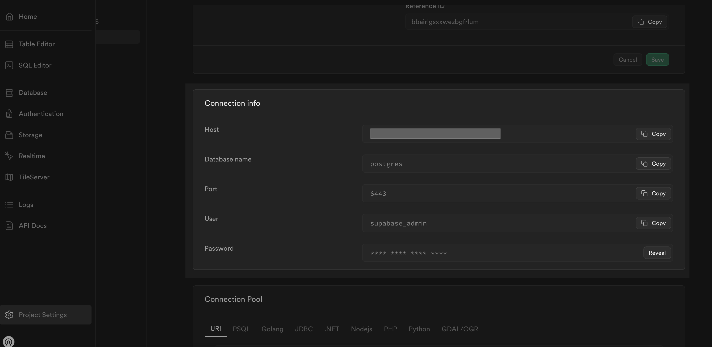
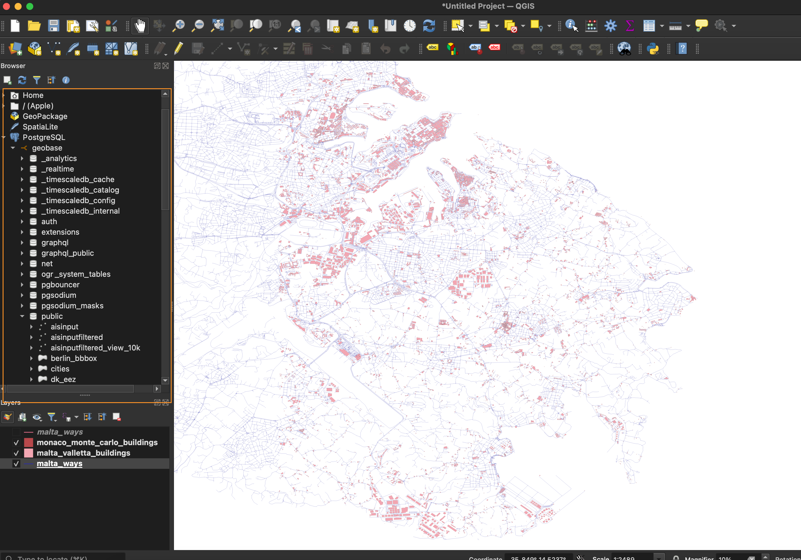

# A Guide to Connecting QGIS and GeoBase for GIS Analysts

## Introduction
Geospatial Information Systems (GIS) play a crucial role in analyzing, managing, and visualizing spatial data. The powerful tools often used by GIS analysts includes **QGIS**.

- **QGIS** is an open-source GIS application that allows users to view, edit, and analyze geospatial data.

This documentation will guide you through setting up **QGIS** with **GeoBase**.

## 1. Setting Up QGIS
**QGIS** is a versatile desktop GIS application that supports a wide range of vector and raster formats. It allows users to perform spatial analysis, map production, and geospatial data management.
To setup QGIS on your system, you can follow the official installation guide: [https://qgis.org/en/site/forusers/download.html](https://qgis.org/en/site/forusers/download.html)

## 2. Connecting with GeoBase
To connect QGIS with GeoBase, you need to create a new PostgreSQL database connection.

The connection details include:
- **Name**: A name for the connection.
- **Host**: The host address of the database.
- **Port**: The port number for the database service.
- **Database**: The name of the database.
- **Username**: The username to access the database.
- **Password**: The password for the database user.

These details can be obtained from the GeoBase Project Settings.

### Visualize Data
As a GIS analyst, you can visualize spatial data using QGIS. You can load shapefiles, GeoJSON files, and other geospatial data formats into QGIS for analysis and visualization.

Under public in your database you can find the tables that you can visualize in QGIS.

Now you are ready to start working with QGIS and GeoBase as a GIS analyst.
The combination of these tools will help you analyze and visualize spatial data effectively.
