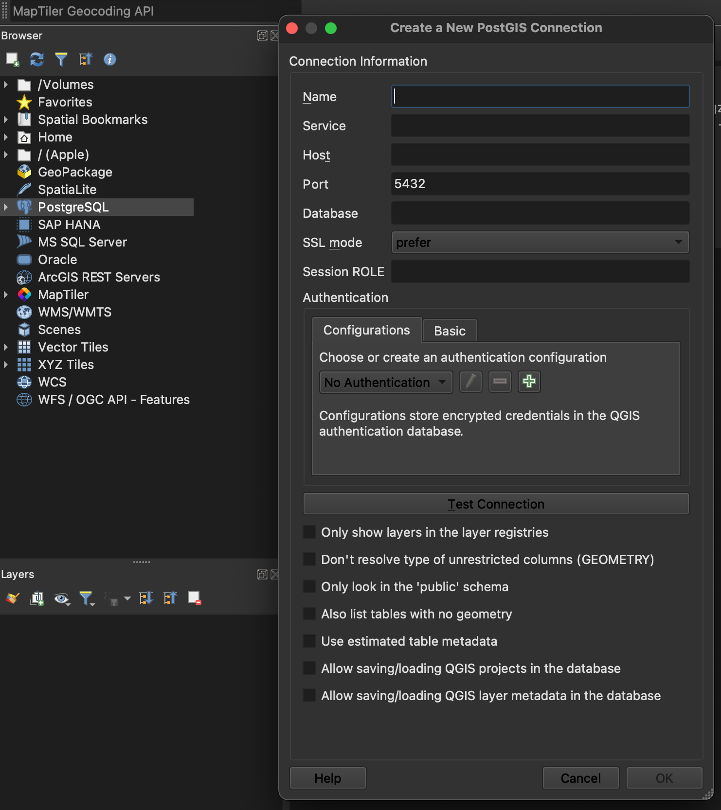
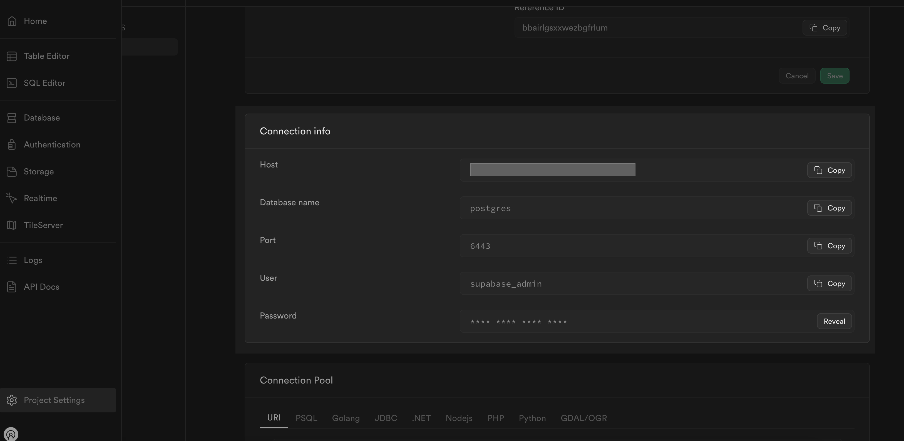
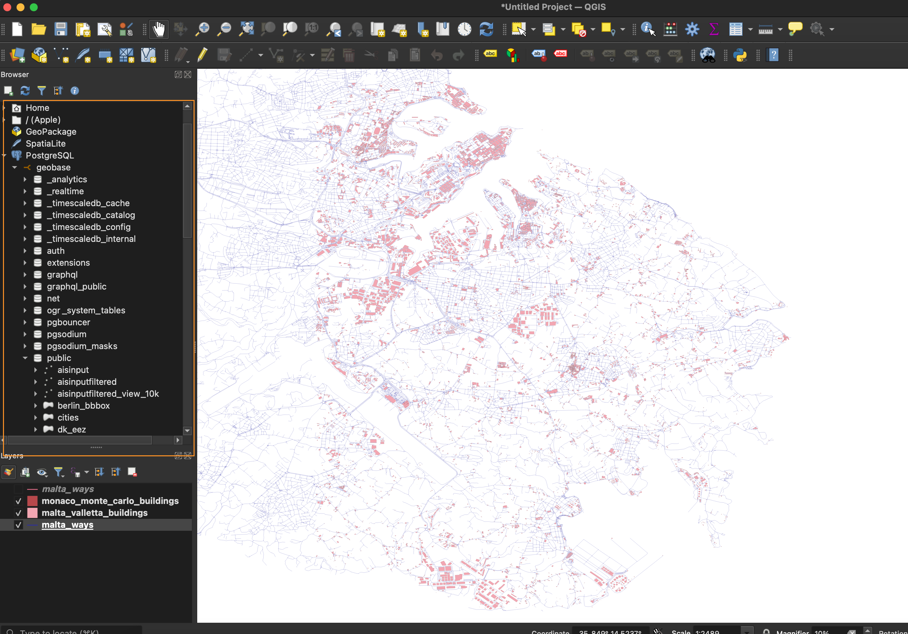

import { Steps, Callout } from 'nextra/components'

# A Guide to Connecting QGIS and Geobase for GIS Analysts

## Introduction
Geospatial Information Systems (GIS) play a crucial role in analyzing, managing, and visualizing spatial data. One of the most popular tools used by GIS analysts is **QGIS**. **QGIS** is an open-source desktop GIS application that allows users to view, edit, and analyze geospatial data.

This documentation will guide you through setting up **QGIS** with **Geobase**. By the end of this guide you will be able to:
- Setup QGIS
- Connect QGIS to Geobase
- Visualize Geospatial Data

<Steps>

### Setting Up QGIS

Follow the official installation guide: [https://qgis.org/en/site/forusers/download.html](https://qgis.org/en/site/forusers/download.html)

<Callout type="info" emoji="💚">
QGIS is open source so don't forget to support the project by [donating](https://qgis.org/funding/donate/) to the QGIS project.
</Callout>

### Connecting QGIS to Geobase
Connecting QGIS to Geobase is very similar to connecting to PostgreSQL, you need to create a new PostgreSQL database connection.

To connect with Geobase use the `PostgreSQL` tab in the Browser panel, right-click on the PostgreSQL option to create a `New Connection`.

{/* <picture>
  <source media="(prefers-color-scheme: dark)" srcSet="./images/qgis_connection.png"/>
  <source media="(prefers-color-scheme: light)" srcSet="./images/qgis_connection.png"/>
  
</picture> */}

The connection details include:
- **Name**: A name for the connection.
- **Host**: The host address of the database.
- **Port**: The port number for the database service.
- **Database**: The name of the database.
- **Username**: The username to access the database.
- **Password**: The password for the database user.

To obtain these connection details, navigate to `Geobase` and click on `Project Settings` in the left navigation panel. You will find the required information under the `Connection Info`.

### Loading and Visualize Data from Geobase into QGIS

After connecting QGIS to Geobase, you can load data from Geobase into QGIS by clicking `PostgreSQL` in Browser Panel and then selcting your databse.
To visualize the data, right-click on the table you want to visualize in `public` scheme and select `Add Layer to Project` or you can drag and drop table in `Layers` Panel.

<Callout type="warning" emoji="⚠️">
Make sure to select tables from the `public` schema when adding layers to the project. The other schemas are not for manipulation and are used for internal purposes.
</Callout>

</Steps>
Now you are ready to start working with QGIS and Geobase as a GIS analyst.
The combination of these tools will help you analyze and visualize spatial data effectively.
