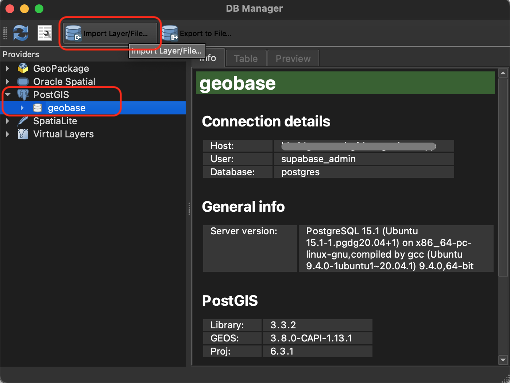
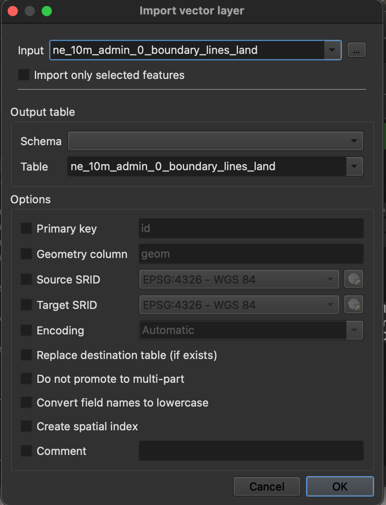
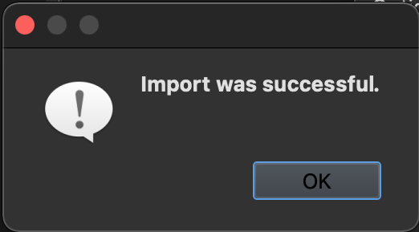
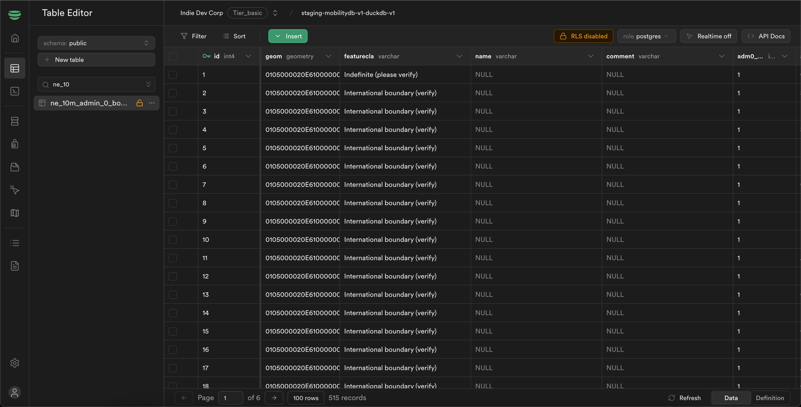

import { Callout } from 'nextra/components'
import { Steps } from 'nextra/components'

# Importing Data into Geobase using QGIS

This guide will walk you through the process of importing data into **Geobase** using **QGIS**.
<Steps>
### Connect QGIS to PostgreSQL

To connect QGIS to Geobase, you can follow the steps outlined in the [Getting Started](./getting-started).

> **Note:** Ensure that you have the necessary permissions to access the PostgreSQL database.

### Load Data into QGIS

Add the spatial data you want to import, such as shapefiles or GeoJSON files in QGIS.
Data used in the example is from Natural Earth, you can download the data from [Natural Earth](https://naciscdn.org/naturalearth/10m/cultural/ne_10m_admin_0_boundary_lines_land.zip).

### Export Data to Geobase

Once you have loaded the data into QGIS, you can export it to Geobase by following these steps:

Open DB Manager in QGIS by going to `Database > DB Manager`.
In the list of PostGIS databases, find the one you want to export to, find the desired schema, and press `Import Layer/File...`.

Select the layer in the **Input** field you want to export and press `OK`.

You will see a success message like below:

### Verify Data in Geobase

Open the Geobase web interface, select your project, and navigate to the `Table Editor`.
You should see the table you imported in the public schema like below:

    <Callout type="info" emoji="💡">
        If the table does not appear, ensure that the import process completed successfully and refresh the page.
    </Callout>
</Steps>
