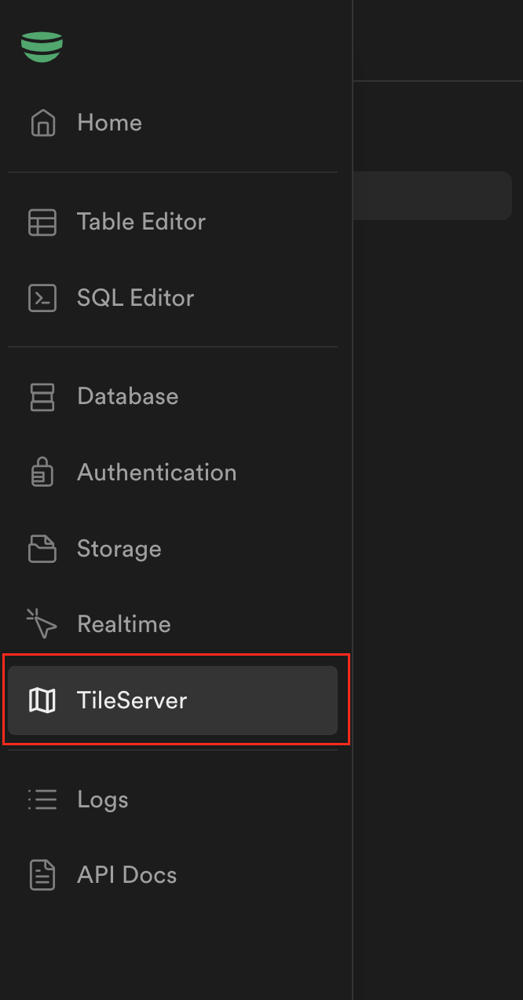
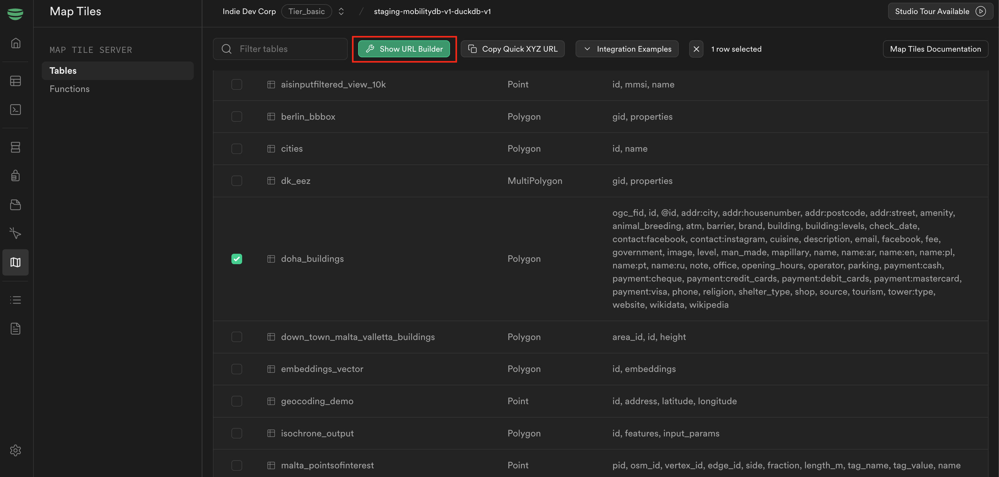
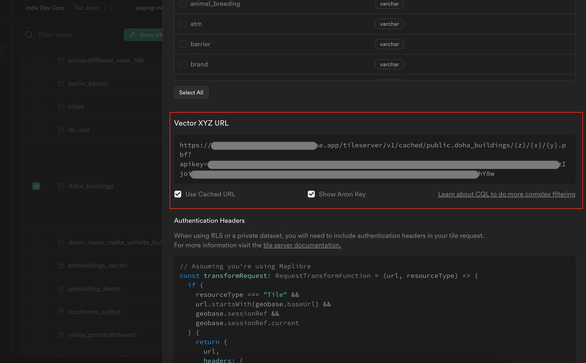
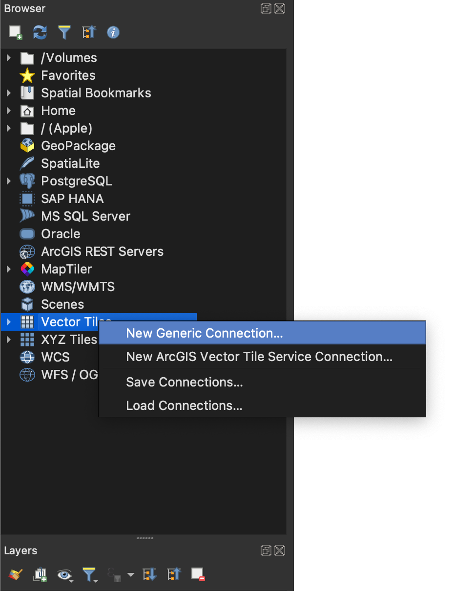
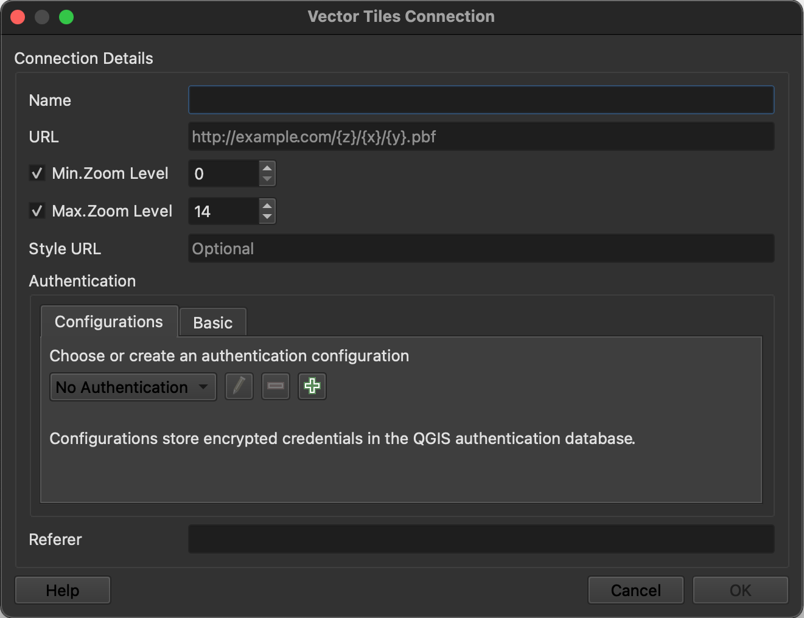
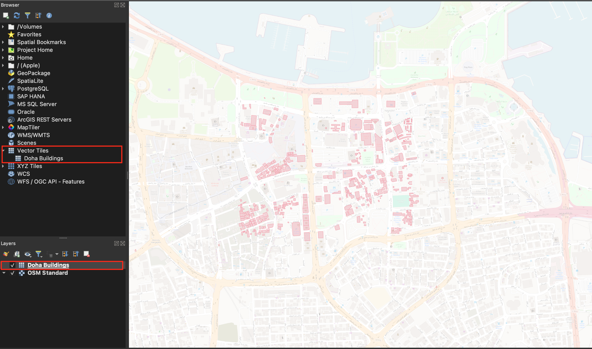

import { Callout } from 'nextra/components'
import { Steps } from 'nextra/components'

# Working with Vector Tiles in QGIS

This guide will help you integrate and visualize Geobase tables as Vector Tiles within QGIS using an Vector XYZ URL.

<Steps>
### Get Vector XYZ URL from Geobase

Log in to your Geobase account. 👉 https://geobase.app

Navigate to the TileServer tab in the navigation sidebar.

    

Select the table or tables you want to visualize as vector tiles and click on the `Show URL Builder` button.
    
    

Copy the `Vector XYZ URL` from the `URL Builder` pannel.
    
    
    
    <Callout type="info" emoji="💡">
    Make sure you select the `Show Anon Key` checkbox.
    </Callout>

    <Callout type="warning" emoji="⚠️">
    Watchout! the anon key will only work if your table hasn't got row level security enabled. If your table has row level security enabled you will need to use the service key instead. You can grab the service key from the project settings page.
    </Callout>

    <Callout type="info" emoji="💡">
    Optionally, you can select the `Use Cached URL` checkbox to use a cached version of the vector tiles.
    </Callout>

### Add Vector Tiles to QGIS
In QGIS, to work with vector tiles use the `Vector Tiles` tab in the Browser panel, right-click on the `Vector Tiles` and select `New Generic Connection`.

    

Paste the `Vector XYZ URL` you copied from Geobase in the previous step in the `URL` field and give the vector tile a name, then click `OK`.
    
    

The vector tile will be added to the `Vector Tiles` tab in the Browser panel.

### Visualize Vector Tiles

Drag and drop the vector tile to the `Layers` panel to visualize it.

    
</Steps>
