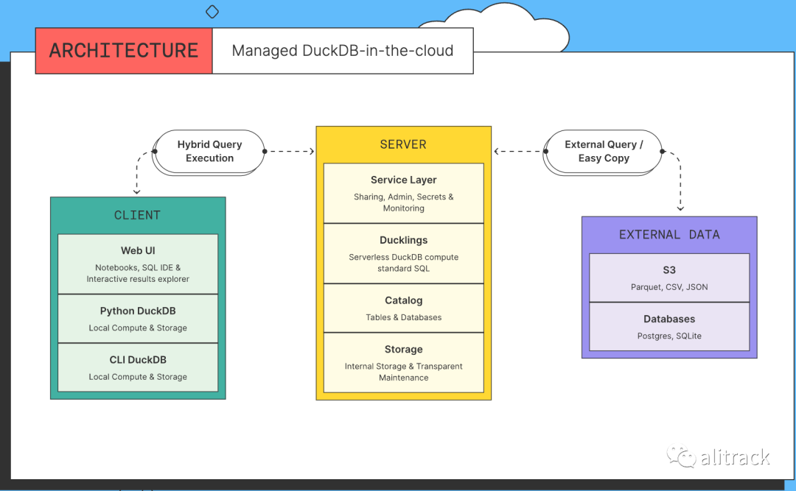
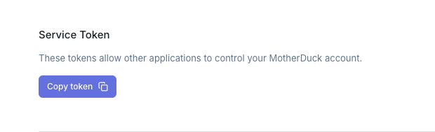
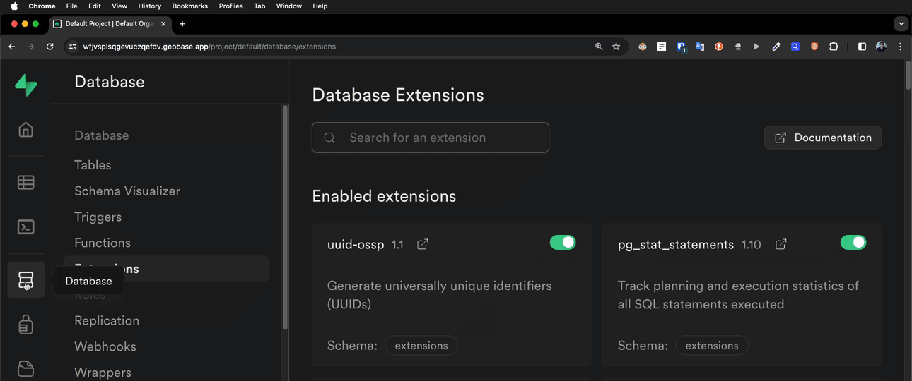
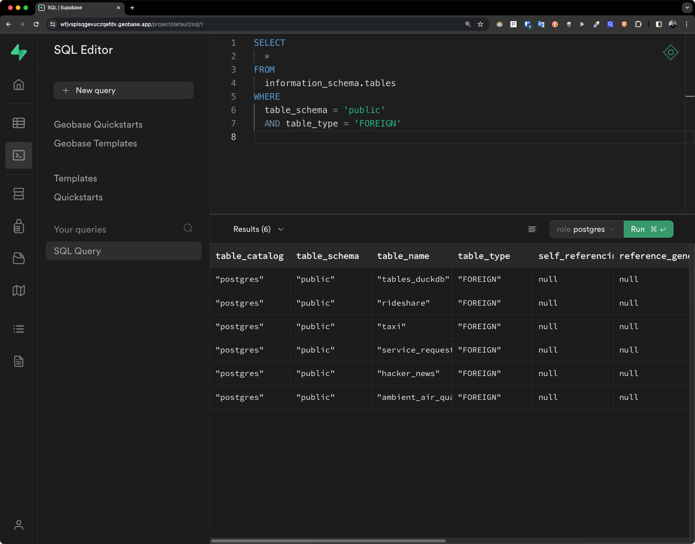
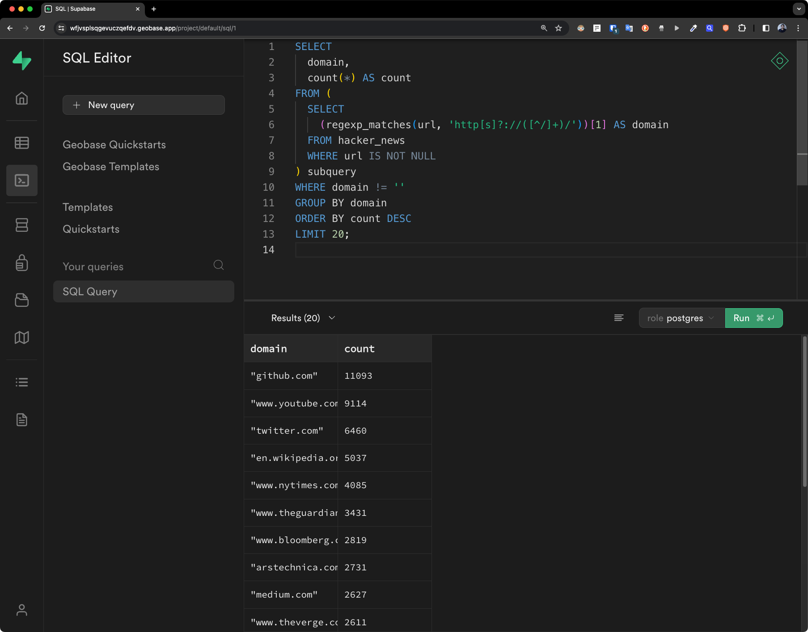
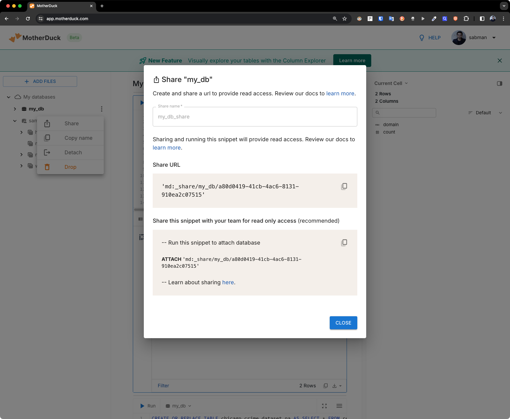
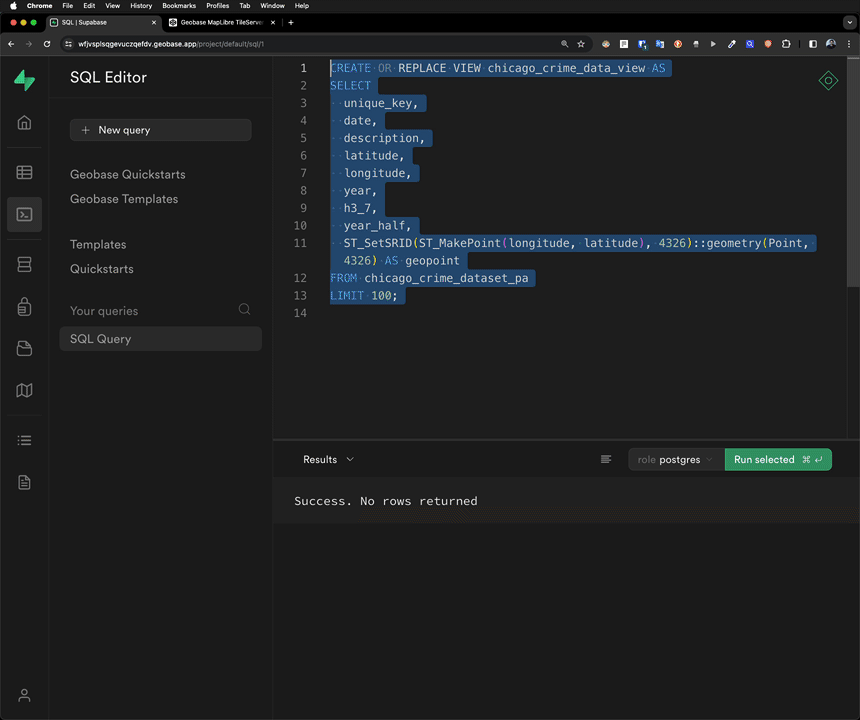

# How does Geobase Postgres access MotherDuck



## What is MotherDuck?

MotherDuck is a cloud-based analytics service built on top of DuckDB. DuckDB is a free and open-source embedded OLAP database developed and maintained by the DuckDB community and DuckDB Labs. MotherDuck is an independent organization closely collaborating with DuckDB Labs to build a cloud-based analytics platform based on DuckDB.
Some features of MotherDuck include:

-   Cloud database storage: Manage your DuckDB database directories in the cloud for easy scalability and collaboration.
-   SQL analytics engine: Efficiently run the same SQL queries on data stored locally, in MotherDuck, or in your data lake.
-   Simplified database sharing: Create a shareable data snapshot that your colleagues can easily attach in MotherDuck.
-   Hybrid query execution: Utilize the idle computing power on your laptop in coordination with the cloud to improve speed and reduce costs.
-   Notebook-style UI: Browse data directories, write SQL, filter and sort results, and share data using a web interface.
-   Powerful DuckDB ecosystem: Import, orchestrate, and perform business intelligence with over 25 modern tools.

MotherDuck is suitable for data applications that don't require petabyte-scale data warehousing and can also query your data in your data lake. MotherDuck can also serve as a backend service for data applications based on DuckDB.

## Preparation

First you need to have a MotherDuck account register MotherDuck is currently free to use, visit the Sign Up page, Choose a method you like to register an account. Then go to settings page to get your service token.



## Enable duckdb_fdw in geobase

In geobase go to Database > Extensions > duckdb_fdw and "Enable" the extension.



## Create a foreign server

In geobase go to SQL Editor and run the following SQL to create a foreign server.

```sql
DROP EXTENSION if exists duckdb_fdw CASCADE;
CREATE EXTENSION IF NOT EXISTS duckdb_fdw; WITH SCHEMA extensions CASCADE;

CREATE SERVER DuckDB_server FOREIGN DATA WRAPPER duckdb_fdw
OPTIONS (database 'md:?motherduck_token=<motherduck_token>&saas_mode=true');
```

Replace `<motherduck_token>` with the service token copied earlier.

Create a view for easy inspection of which databases and tables are in motherduck.

```sql
SELECT duckdb_execute('duckdb_server', 'create view tables_duckdb as SELECT * FROM information_schema.tables');
IMPORT FOREIGN SCHEMA public FROM SERVER DuckDB_server INTO public;
SELECT * FROM tables_duckdb;
```

Suppose now I want to import all Schema tables in the database `sample_data` in MotherDuck to geobase.

```sql
SELECT duckdb_execute('duckdb_server','set search_path TO ''sample_data,my_db'';');
IMPORT FOREIGN SCHEMA nyc  FROM SERVER DuckDB_server INTO public;
IMPORT FOREIGN SCHEMA hn   FROM SERVER DuckDB_server INTO public;
IMPORT FOREIGN SCHEMA who  FROM SERVER DuckDB_server INTO public;
SELECT *  FROM information_schema.tables
  WHERE table_schema='public' AND table_type='FOREIGN';
```



Here the `sample_data` and `my_db` are the schema names in the MotherDuck database.


Next let's query the data in the `hacker_news` schema.

```sql
SELECT
  domain,
  count(*) AS count
FROM (
  SELECT
    (regexp_matches(url, 'http[s]?://([^/]+)/'))[1] AS domain
  FROM hacker_news
  WHERE url IS NOT NULL
) subquery
WHERE domain != ''
GROUP BY domain
ORDER BY count DESC
LIMIT 20;
```

NOTE: Postgres does not have a `regexp_extract` function and needs to be replaced by `regexp_matches`.



## Uploading data to MotherDuck

We are going to upload the `chicago_crime_dataset_pa.parquet` table to MotherDuck. File can be downloaded from [here](./_duckdb_fdw/chicago_crime_dataset_pa.parquet).

For this on the MotherDuck UI, click on the `ADD FILES` button to upload a new dataset. Afterward click on the three dots on the right of the dataset and select `Share`. This will present the following dialog.

 Copy the `Share URL` and use it to create a foreign table in geobase.

```sql
SELECT duckdb_execute('duckdb_server','ATTACH ''md:_share/my_db/a80d0419-41cb-4ac6-8131-910ea2c07515'' as md_share ;');
SELECT duckdb_execute('duckdb_server','set search_path TO ''md_share,sample_data,my_db'';');
IMPORT FOREIGN SCHEMA public LIMIT TO(chicago_crime_dataset_pa) FROM SERVER DuckDB_server INTO public;
SELECT * FROM chicago_crime_dataset_pa LIMIT 5;
```

Next let's create a view with a postgis column.

```sql
CREATE OR REPLACE VIEW chicago_crime_data_view AS
SELECT
  unique_key,
  date,
  description,
  latitude,
  longitude,
  year,
  h3_7,
  year_half,
  ST_SetSRID(ST_MakePoint(longitude, latitude), 4326)::geometry(Point, 4326) AS geopoint
FROM chicago_crime_dataset_pa
LIMIT 100;
```



Build something amazing with MotherDuck and Geobase! 🐥🚀
