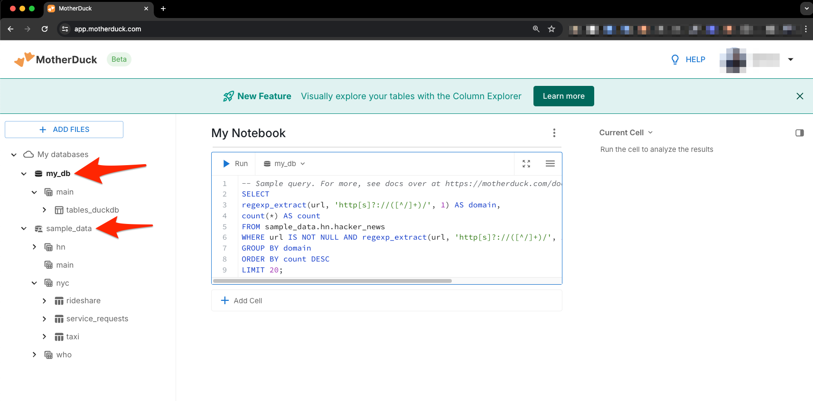

# How does Geobase Postgres access MotherDuck

import { Callout } from 'nextra/components'

In his guide we will get you started with MotherDuck and how to access it from Geobase Postgres. By the end of it you will be able to:
1. Run SQL queries on MotherDuck from within Geobase 
2. Query data stored in MotherDuck via Geobase's REST API from frontend applications
3. Visualise data stored in MotherDuck using Geobase's Map Tile Server

By the end you will have the following running:


<Callout type="info" emoji="ℹ️">
  **Note:** This guide is meant to be followed in the order presented.
</Callout>


## What is MotherDuck? 

> skip if you already know

> TLD;R MotherDuck is a cloud-based analytics service built on top of DuckDB.


MotherDuck is a cloud-based analytics service built on top of DuckDB. DuckDB is an open-source embedded OLAP database developed and maintained by the DuckDB community and DuckDB Labs. MotherDuck is an independent organization closely collaborating with DuckDB Labs to build a cloud-based analytics platform based on DuckDB.

Some features of MotherDuck include:

-   Cloud database storage: Manage your DuckDB database directories in the cloud for easy scalability and collaboration.
-   SQL analytics engine: Efficiently run the same SQL queries on data stored locally, in MotherDuck, or in your data lake.
-   Simplified database sharing: Create a shareable data snapshot that your colleagues can easily attach in MotherDuck.
-   Hybrid query execution: Utilize the idle computing power on your laptop in coordination with the cloud to improve speed and reduce costs.
-   Notebook-style UI: Browse data directories, write SQL, filter and sort results, and share data using a web interface.
-   Powerful DuckDB ecosystem: Import, orchestrate, and perform business intelligence with over 25 modern tools.

MotherDuck is suitable for data applications that don't require petabyte-scale data warehousing and can also query your data in your data lake. MotherDuck can also serve as a backend service for data applications based on DuckDB.

## Preparation

> TLD;R: Get a MotherDuck account and a service token.

First you need to have a MotherDuck account register MotherDuck is currently free to use, visit the Sign Up page, Choose a method you like to register an account. Then go to settings page to get your service token.


## Enable `duckdb_fdw` in geobase


In geobase go to `Database > Extensions > duckdb_fdw` and toggle the switch to "Enable" the extension.


## Create foreign data wrapper server

In geobase go to SQL Editor and run the following SQL to create a foreign server. 


<Callout type="info" emoji="ℹ️">
  **Note:** Replace `YOUR_MOTHERDUCK_TOKEN` in the SQL with the service token copied earlier.
</Callout>

```sql
-- Clean up (optional)
-- DROP EXTENSION if exists duckdb_fdw CASCADE;
-- CREATE EXTENSION IF NOT EXISTS duckdb_fdw; WITH SCHEMA extensions CASCADE;

-- Create the foreign server
DO $$
DECLARE
  motherduck_token TEXT;
BEGIN
  -- Assign the value of the configuration setting to the variable
  motherduck_token := 'YOUR_MOTHERDUCK_TOKEN';

  -- Check if the token matches the JWT pattern
  IF NOT (motherduck_token ~ '^[a-zA-Z0-9_-]+\.[a-zA-Z0-9_-]+\.[a-zA-Z0-9_-]+$') THEN
    RAISE EXCEPTION 'motherduck_token variable is not set. Please replace YOUR_MOTHERDUCK_TOKEN with a valid value';
  END IF;

  -- Create the foreign server using the token
  EXECUTE format(
    'CREATE SERVER duckdb_server FOREIGN DATA WRAPPER duckdb_fdw OPTIONS (database ''md:?motherduck_token=%s&saas_mode=true'')',
    motherduck_token
  );
END $$;
```

<Callout type="default" emoji="🎉">
  Woho! You have successfully created a foreign server for MotherDuck. Which means you can run queries on the MotherDuck from with-in geobase! 🚀
</Callout>


## Run SQL on MotherDuck

Create a view for easy inspection of which databases and tables are in motherduck.

```sql
-- execute sql on duckdb server hosted by motherduck to create a view
SELECT duckdb_execute('duckdb_server',
  'CREATE VIEW IF NOT EXISTS tables_duckdb AS SELECT * FROM information_schema.tables'
);
```

Now we can import the view we just created into geobase and query it.

```sql
-- import tables and views from motherduck public shcema into public schema on geobase
IMPORT FOREIGN SCHEMA public FROM SERVER duckdb_server INTO public;


-- query the view we just created on motherduck
SELECT * FROM tables_duckdb;
```

MotherDuck tables are now visible in geobase. 🎉

## Import from other motherduck databases

> TLD;R: Import tables from other databases in MotherDuck.

MotherDuck comes preloaded with some sample data. This is stored in the `sample_data` database. Suppose now I want to import all tables in the database `sample_data` in MotherDuck to geobase. For this we need to update the search path to include the `sample_data` database and the we can import the tables from the `sample_data` database which are in various schemas.

```sql
-- on motherduck set the search path to the schema you want to import
SELECT duckdb_execute('duckdb_server','set search_path TO ''sample_data,my_db'';');
-- 
IMPORT FOREIGN SCHEMA nyc  FROM SERVER DuckDB_server INTO public;
IMPORT FOREIGN SCHEMA hn   FROM SERVER DuckDB_server INTO public;
IMPORT FOREIGN SCHEMA who  FROM SERVER DuckDB_server INTO public;
SELECT *  FROM information_schema.tables WHERE table_schema='public' AND table_type='FOREIGN';
```


Here the `sample_data` and `my_db` are the schema names in the MotherDuck database.



Next let's query the data in the `hacker_news` schema.

```sql
SELECT
  domain,
  count(*) AS count
FROM (
  SELECT
    (regexp_matches(url, 'http[s]?://([^/]+)/'))[1] AS domain
  FROM hacker_news
  WHERE url IS NOT NULL
) subquery
WHERE domain != ''
GROUP BY domain
ORDER BY count DESC
LIMIT 20;
```

<Callout type="info" emoji="ℹ️">
  **Note:** PostgreSQL does not have a `regexp_extract` function and needs to be replaced by `regexp_matches`.
</Callout>


## Upload data to MotherDuck

We are going to upload the `chicago_crime_dataset_pa.parquet` table to MotherDuck. File can be downloaded from [here](./_duckdb_fdw/chicago_crime_dataset_pa.parquet).

For this on the MotherDuck UI, click on the `ADD FILES` button to upload a new dataset. This will create a cell with SQL to import the dataset. Run the cell to import the dataset.


```sql
IMPORT FOREIGN SCHEMA public LIMIT TO(chicago_crime_dataset_pa) FROM SERVER duckdb_server INTO public;
SELECT * FROM chicago_crime_dataset_pa LIMIT 5;
```

## Map Visualization

For us to visualise the data on a map we need to create a view with a PostGIS column. This allows geobase to automatically detect the geometry column and create an end point for the map tile server.

### Create a view with a PostGIS column

Next let's create a view with a postgis column.

```sql
CREATE OR REPLACE VIEW chicago_crime_data_view AS
SELECT
  unique_key,
  date,
  description,
  latitude,
  longitude,
  year,
  h3_7,
  year_half,
  ST_SetSRID(ST_MakePoint(longitude, latitude), 4326)::geometry(Point, 4326) AS geopoint
FROM chicago_crime_dataset_pa
LIMIT 100;
```

### Fronted Map via Tile Server

Now we can access the data via the Geobase Map Tile Server. 


## Query via REST API

You can also use the REST API to query the data stored in MotherDuck. 

```bash
# TEST API
curl 'https://[GEOBASE_PROJECT_ID].geobase.app/rest/v1/chicago_crime_data_view' \
  -H "apikey: [GEOBASE_ANON_KEY]" \
  -H "Authorization: Bearer [GEOBASE_ANON_KEY]"
```

## Conclusion

Build something amazing with MotherDuck and Geobase! 🐥🚀
