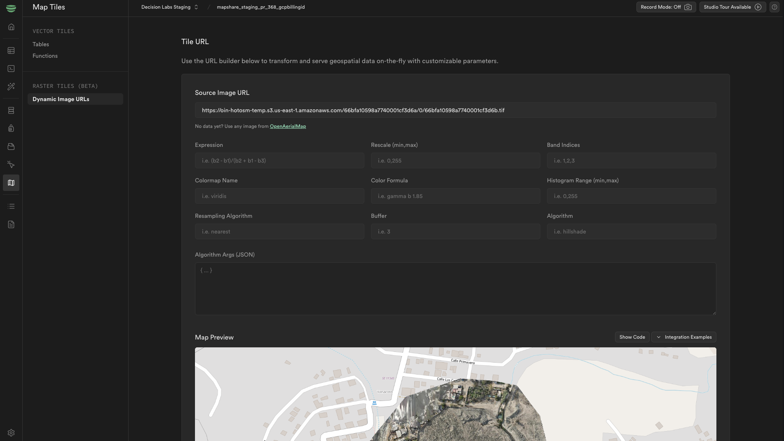

import { Callout } from 'nextra/components'

# Remote Sensing in Geobase (beta)

<Callout type="warning" emoji="⚠️">
  **Note:** This feature is currently in beta. Avoid using it for large datasets.
</Callout>

Remote sensing is the process of detecting and monitoring the physical characteristics of an area by measuring its reflected and emitted radiation at a distance (typically from satellite or aircraft). This guide will help you get started with remote sensing in Geobase by leveraging [Titiler](https://developmentseed.org/titiler/).

<Callout type="warning" emoji="⚠️">
	The Titiler service in Geobase is currently in beta. If you encounter any issues or have feedback, please let us know!
</Callout>

## Getting Started

To begin working with remote sensing data in Geobase:

1. Navigate to the "Map Tiles" section in Geobase Studio
2. Select "Raster Tiles" from the sidebar
3. Click on the "Dynamic Image URL" tab



This will give you access to our beta Titiler service with the following endpoints:

- `/cog/tiles/{tileMatrixSetId}/{z}/{x}/{y}`
- `/cog/bounds`

### Important Notes About Data Format

- The input dataset URL must point to a Cloud Optimized GeoTIFF (COG) file
- Regular image formats (JPEG, PNG, etc.) are not supported
- COGs are specially optimized GeoTIFF files that enable efficient streaming and partial reading

## API Endpoints

The main endpoint for accessing tiles is:

```
/cog/tiles/{tileMatrixSetId}/{z}/{x}/{y}
```

### Required Parameters

| Parameter       | Description                                                                 |
| --------------- | --------------------------------------------------------------------------- |
| z, x, y         | Tile coordinates (automatically handled by mapping libraries like MapLibre) |
| url             | URL to a Cloud Optimized GeoTIFF (COG) dataset                              |
| tileMatrixSetId | Tile matrix set identifier. Usually just WebMercatorQuad                    |

### Projection Considerations

- Incorrect tileMatrixSetId parameter could impact performance or stability
- Stick to WebMercatorQuad unless you have specific requirements for other projections

### Optional Parameters

#### Tile Configuration

- `scale` (integer, 1-4): Tile size scale. 1=256x256, 2=512x512...
- `format` (string): Output image format
- `buffer` (number): Buffer on each side of the tile (multiple of 0.5)
- `padding` (integer): Padding to reduce resampling artifacts

#### Band Selection and Processing

- `bidx` (array): Band indexes to include (e.g., [1] or [1,2,3])
- `expression` (string): Band math expression (e.g., "b1/b2" or "b1/b2;b2+b3")
- `nodata` (number/string): Override internal nodata value
- `unscale` (boolean): Apply internal Scale/Offset

#### Resampling and Reprojection

- `resampling` (string): Resampling algorithm (nearest, bilinear, cubic, etc.)
- `reproject` (string): WarpKernel resampling algorithm for reprojection

#### Visualization

- `colormap_name` (string): Name of predefined colormap
- `colormap` (string): JSON encoded custom colormap
- `rescale` (array): Min/Max data rescaling (e.g., ["0,2000"])
- `color_formula` (string): rio-color formula for color manipulation

#### Advanced Processing

- `algorithm` (string): Processing algorithm (options: hillshade, contours, normalizedIndex, terrarium, terrainrgb, cast, ceil, floor)
- `algorithm_params` (string): Parameters for the selected algorithm
- `return_mask` (boolean): Include mask in output data

## Implementation Example with MapLibre GL JS

Here's a complete example showing how to display a COG layer using MapLibre GL JS.
Remember to replace `your-project.geobase.app` and `your-api-key` with your actual Geobase project URL and API key.


```html
<!DOCTYPE html>
<html lang="en">
	<head>
		<title>Raster Tile Viewer</title>
		<meta charset="utf-8" />
		<meta name="viewport" content="width=device-width, initial-scale=1" />
		<link rel="stylesheet" href="https://unpkg.com/maplibre-gl@5.1.0/dist/maplibre-gl.css" />
		<script src="https://unpkg.com/maplibre-gl@5.1.0/dist/maplibre-gl.js"></script>
		<style>
			body {
				margin: 0;
				padding: 0;
			}
			html,
			body,
			#map {
				height: 100%;
			}
		</style>
	</head>
	<body>
		<div id="map"></div>
		<script>
			async function initMap() {
				try {
					// Fetch bounds of the COG file
					const boundsResponse = await fetch(
						`https://your-project.geobase.app/titiler/v1/cog/bounds?url=${encodeURIComponent(cogUrl)}&apikey=your-api-key`,
					);
					const boundsData = await boundsResponse.json();
					const bounds = boundsData.bounds;

					// Initialize the map
					const map = new maplibregl.Map({
						container: "map",
						bounds: new maplibregl.LngLatBounds([bounds[0], bounds[1]], [bounds[2], bounds[3]]),
						style: {
							version: 8,
							sources: {
								osm: {
									type: "raster",
									tiles: ["https://tile.openstreetmap.org/{z}/{x}/{y}.png"],
									tileSize: 256,
									attribution: "© OpenStreetMap contributors",
								},
							},
							layers: [
								{
									id: "osm-tiles",
									type: "raster",
									source: "osm",
									minzoom: 0,
									maxzoom: 19,
								},
							],
						},
					});

					// Add COG layer when map loads
					map.on("load", () => {
						map.addSource("cog-layer", {
							type: "raster",
							tiles: [
								`https://your-project.geobase.app/titiler/v1/cog/tiles/WebMercatorQuad/{z}/{x}/{y}?url=${encodeURIComponent(cogUrl)}`,
							],
							tileSize: 256,
						});

						map.addLayer({
							id: "cog-layer",
							type: "raster",
							source: "cog-layer",
							minzoom: 0,
							maxzoom: 22,
						});
					});
				} catch (error) {
					console.error("Error initializing map:", error);
				}
			}

			initMap();
		</script>
	</body>
</html>
```
