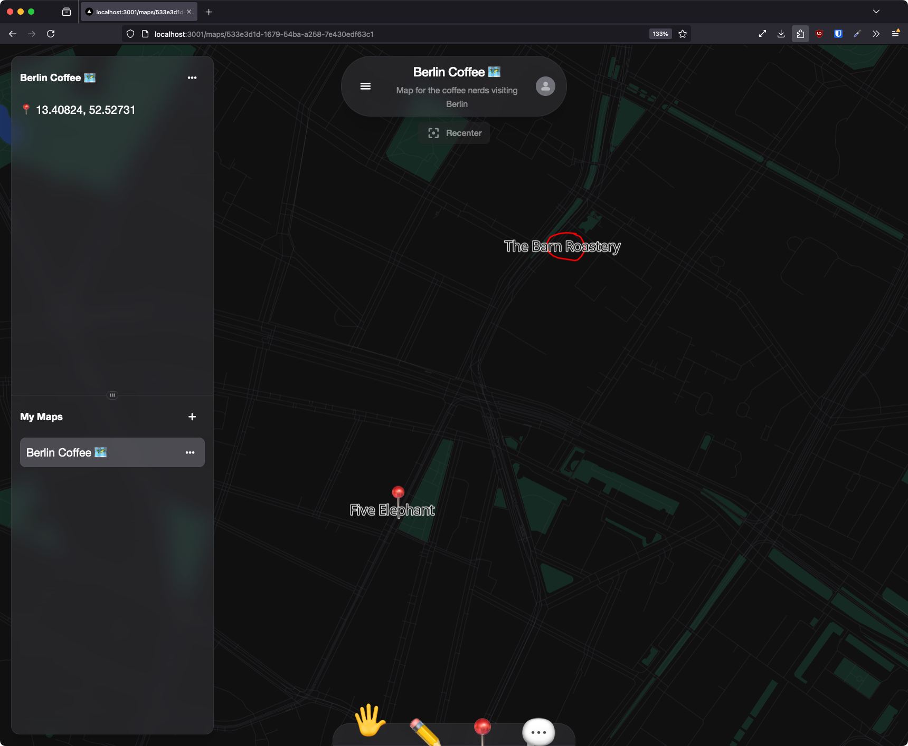

# Getting Started with Geobase

Welcome to the Geobase documentation site. Geobase is in early beta you can join the waitlist [here](https://geobase.app).

## Building your first Geobase App

TL;DR If you already have a Geobase account let's get you started with a sharable map app with realtime features.

{/* TODO: Add a video here */}

## What is Geobase?

Geobase extends the capabilities of Supabase for the geospatial industry. The aim of Geobase is to enable geospatial software developers to build location intelligence applications faster without missing out on the benefits of a full stack framework.

Our moto is:

> "Geo for the rest of us" because we believe that geospatial data is too important to be left to the experts.

## What is Supabase?

Supabase is an open source Firebase alternative. It provides a Postgres database, realtime data subscription, and an auth system.

## What is Postgres?

Postgres is an open source relational database. It is a powerful tool for storing and querying geospatial data.

