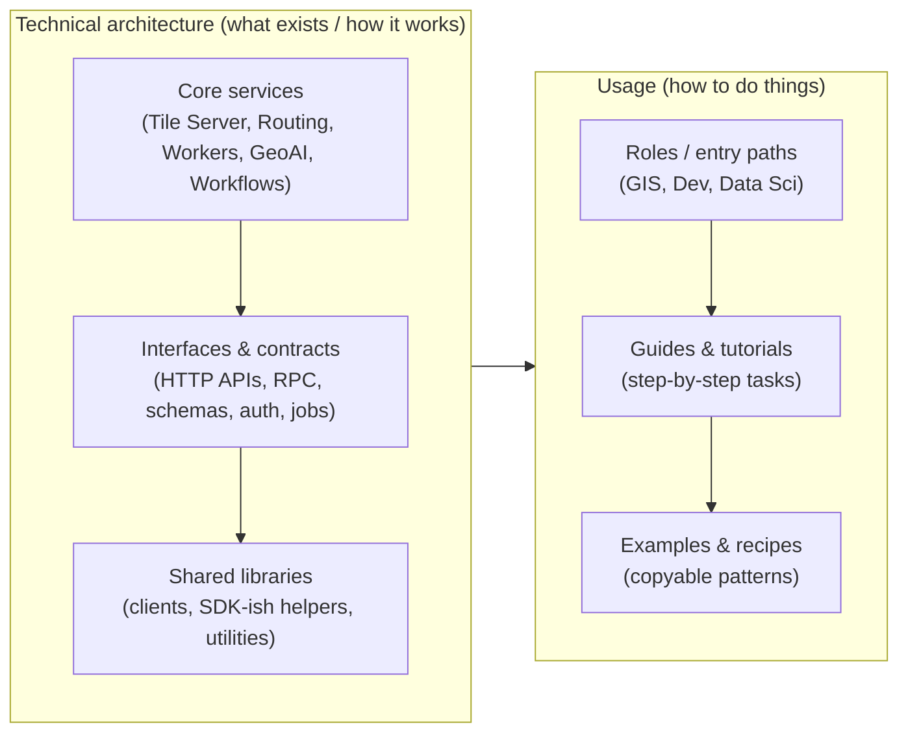

# Docs Mental Model TODO

The current docs navigation/structure feels ambiguous: users can’t clearly predict “where things go,” and concepts are getting blurred.

We need a clean cognitive separation between these major buckets:

- Roles-based learning paths (GIS, dev, data science)
- Guides (how-to workflows)
- API docs (reference and contracts)
- Service descriptions (e.g. Tile Server, Routing Engine) — what the service is / what it provides
- Extensions (optional add-ons / advanced capabilities)

TODO:
1. Define one-sentence definitions for each bucket above and what should/shouldn’t live there.
2. Decide the top-level entry points (tabs) and how each bucket maps to them.
3. Create a “doc placement” rule (a short decision tree) for authors:
   - If the page answers “how”, put it under Guides
   - If it specifies “what endpoints/RPCs/data contracts exist”, put it under API docs
   - If it explains “what a service does and how it fits”, put it under Service descriptions
   - If it’s an add-on capability, put it under Extensions
   - If it’s role-tailored onboarding/training, put it under Roles
4. Audit current pages for mismatches (examples: guides that contain API references, service pages that contain role tutorials, etc.) and propose a minimal move/rename plan.

## Alternate lens: layered architecture

We can also make the mental model clearer using a layered architecture view:

- Core layer: core services/workers/workflows/workflows + geoAI (e.g. Tile Server, Routing Engine, workers, extensions that behave like platform capabilities)
- Integration layer: client APIs/libs (how developers call into the system; SDK-like wrappers, connection patterns, RPC client usage)
- User learning layer: guides/tutorials (step-by-step tasks for specific roles)

The placement rule should be consistent across both lenses:
- If a page teaches “how to call / integrate”, prefer the Integration layer (client APIs/libs).
- If a page teaches “what capabilities exist” at a platform/service level, prefer the Core layer.
- If a page teaches “how to do the job end-to-end”, prefer the User learning layer (guides/tutorials).

## Meta separation: Technical architecture vs Usage

The big organizing principle: keep the “what exists / how it works” content separate from the “how to use it” content.

